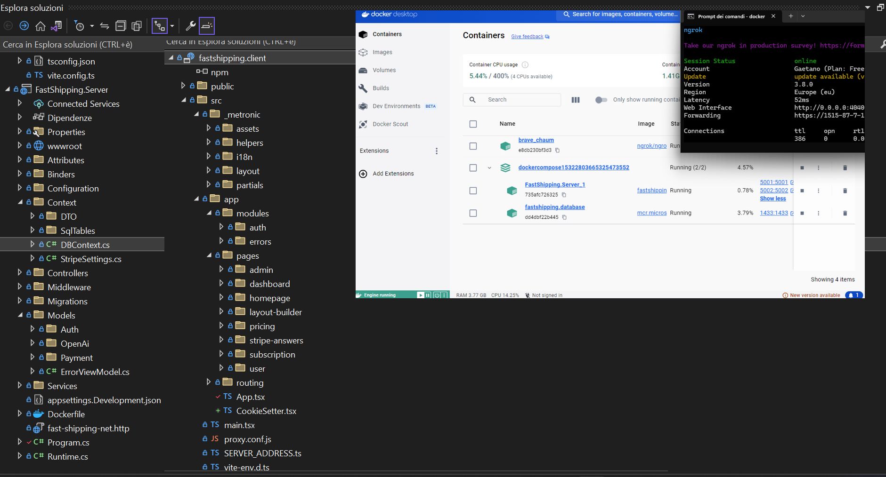

# DoMore-CapstoneProject-Epicode  -- (Video demo a fine doc)
### Capstone project in collaborazione con Braiiin.

Progetto realizzato in un ambiente di lavoro Docker che comprende il client React + Vite in Typescript, il server in .NET Core Web API con l'utilizzo di Entity Framework (Code First), database SQL e l'utilizzo di OpenAI API per implementare un AI chatbox assistant.

Per la parte client ho usato un template di Metronic responsive su qualsiasi dispositivo e browser che mi ha consentito di dedicarmi fortemente alla struttura del backend dove ho gestito l'Auth dell'utente implementando con un serivizio SMTP l'invio di email per verifica account, recupero password e invio fatture, la gestione dei pagamenti Stripe tramite abbonamenti mensili dove ho utilizzo il servizio NGROK per simulare in fase di sviluppo un hosting in modo da poter testare da tutti i dispositivi collegati al mio wifi gestendo le porte e i proxy di client e server sul mio indirizi ipv4.

L'autorizzazione dell'utente genera un token che con i claim salva svariati dati in modo da essere disponibili in tutti i component React, il token api è gestito da middleware che controllano la scadenza e lo rinnovano ciclicamente, tutti gli endpoint utilizzano DTOs ed Class Extension che mostrano o nascondono certi tipi di informazioni per una maggiore sicurezza, quando ho utilizzato direttamente dei model per evitare conflitti ho sfruttato i JsonIgnore. I controlli e la pulizie delle stringhe sono implementati sia frontend che backend, il server usa hashing delle password (SHA256) più Salt, gli altri token come quello del recupero password o il sistema di referral link con gestione dei cookie e session utilizzano GUID o metodi personalizzati.

Molte informazioni vengono gestite dinamicamente dal server senza che i dati vengano salvati per convenienza o sicurezza nel database, ho creato svariati Services che fanno controlli specifici o aiutano a centralizzare metodi più volte richiamati da diversi controller. Ho cercato dunque di gestire ogni step e ogni reazione a catena con assoluta attenzione per non lasciare nulla al caso e immaginare ogni possibile output.

Do More non è solo un app di sviluppo personale, ma è un tracking della propria identità, consente con l'aiuto dell'intelligenza artificiale di sapere quali progessi si stanno facendo, quali sono le debolezze e come migliorare degli aspetti della propria vita, non dando delle scadenze all'utente ma facendo in modo che lo stesso interagisca con l'app di propria volonta e possa facilmente tenere traccia di successi e fallimenti. A seconda dell'abbonamento scelto l'utente ha determinate feature e si ha sempre la possibilità di poter fare un upgrade o downgrade del piano scelto.

## Versione mobile - Video YT

## Account free e plus, pannello admin e recupero password - Video YT

## Attivazione account, referral link e pulizia stringhe - Video YT

## Account premium, chatbot AI e fattura email - Video YT

